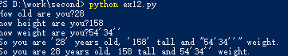
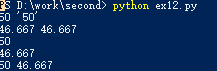

# ex12:%s 与 %r
两者的区别是%s is for display, %r is for debugging.实际代码和效果如下：
代码：
<pre><code>
age = raw_input("How old are you?")
height = raw_input("how height are you?")
weight = raw_input("how weight are you?")
# %r 
print "So you are %r years old, %r tall and %r weight." % \
	(age, height, weight)
# %s
print "So you are %s years old, %s tall and %s weight." % (
	age, height, weight)
</code></pre>
运行效果：

代码：
<pre><code>
like = '50'
hate = 46.667
print "%s %r" % (like, like)
print "%s %r" % (hate, hate)
print like
print hate
print like, hate
</code></pre>
运行效果：

# break lines跨行语句
如上一条所示，python中，语句一般不超过80个字符，（1）当跨行时，可用“\”断行。（2）将左括号放在行尾，右括号放在内容的结尾。
